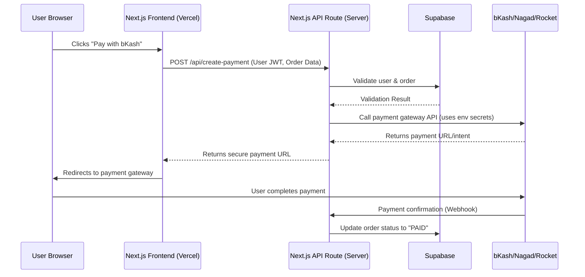

# Zavira - System Patterns

## Architecture Overview

Zavira is a **Full-Stack Next.js 16 Application** using the App Router. It leverages Server Components for performance/SEO and API Routes for secure backend logic.

```mermaid
flowchart TD
    Client[Client Browser] <--> NextF[Next.js Frontend]
    NextF <--> NextAPI[Next.js API Routes / Server Actions]
    NextAPI <--> Supabase[Supabase (Auth & DB)]
    NextAPI <--> Payment[Payment Gateways (bKash/Nagad)]
    
    subgraph Security Boundary
        NextAPI
        Supabase
    end
```

## Core Design Patterns

### 1. Hybrid Rendering (App Router)
- **Server Components (`.tsx`)**: Default. Use for fetching data, RLS interaction, and initial render.
- **Client Components (`'use client'`)**: Use for interactivity (carts, forms, payments).
- **Suspense Boundaries**: Wrap data-fetching components for streaming UI.

### 2. Security & Data Access
- **Row Level Security (RLS)**: The primary firewall. Every table MUST have policies.
- **Server-Side Validation**: All mutations (Zod) occur on the server (API Routes or Actions).
- **Environment Variables**:
  - `NEXT_PUBLIC_*`: Safe for browser (Supabase URL).
  - `process.env.*`: Secrets (Service Keys, Payment Keys) - ONLY on server.

### 3. State Management
- **Auth**: Managed via Supabase Auth Helpers (`@supabase/ssr`) + Middleware.
- **Cart**: Optimistic updates in Context + synced to Supabase `cart_items` table via API.
- **Global**: React Context for UI state (Sidebar, Modals).

### 4. Code Structure (`src/`)
```
src/
├── app/                  # App Router
│   ├── api/              # Secure API Endpoints
│   │   ├── payment/      # Payment processing
│   │   └── webhook/      # Gateway webhooks
│   ├── auth/             # Auth pages
│   └── (shop)/           # Shop routes
├── components/           # UI Components
│   ├── ui/               # Shadcn/Radix primitives
│   └── ...
├── lib/                  # Utilities
│   └── supabase/         # Client/Server/Middleware factories
├── hooks/                # Custom React Hooks
└── types/                # TypeScript Interfaces
```

### 5. Payment Flow (Security Critical)
The following flow MUST be strictly followed to ensure payment security.


```
